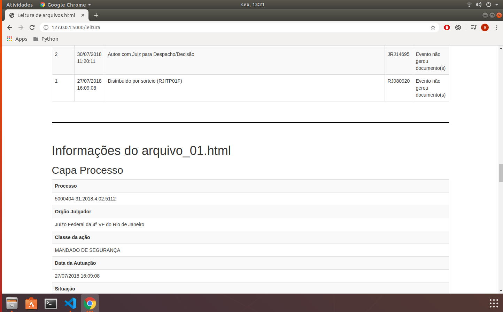

# AppLeituraHtml
Aplicação em Flask para leitura de dados .html

# Como executar a aplicação:

1) Clonar o projeto para uma pasta de sua preferência

2) Abrir o arquivo *activate* dentro da pasta `myenv/bin/`, procurar a variável *VIRTUAL_ENV=* e edita-la colocando o path da sua máquina ( a aplicação foi criada no ambiente linux )

3) Após a edição do arquivo activate, executar os comandos abaixo dentro da pasta do projeto para ativar a virtualenv e executar o projeto na web

`source myenv/bin/activate`

`python3 principal.py`

4) Para executar apenas a leitura do arquivo, descomentar as linhas do arquivo leituraArquivo.py, modificar a variavel path_principal com o caminho da pasta que contém os arquivos e executar o comando abaixo:

`python3 leituraArquivo.py`

# Resultado da Aplicação

